# 迅风战队_电控学习历程

> 学习过程用使用的IDE为**STM32CubeIDE**,辅助软件为programmer（监视stlink的连接情况），claode code辅助编码和chatgpt，csdn，豆包辅助解决问题
>
> - 中途遇到的问题
>
>   1. 安装Cubemx，CubeCLT时，因为电脑user_name为中文导致无法安装成功
>
>   解决方法：查询csdn，和询问chatgpt，最终修改环境变量Temp和Tem路径可以实现成功安装，不过仍存在后期CubeMX无法正常打开，或者异常卡死的问题，最终查询是缓存无法正常清理，最终选择使用STM32CubeIDE中内置的cubemx（也可以）

## 1.GPIO的使用

### 1.1 初识GPIO：

GPIO即 general purpose  input/output 通用输入输出

### 1.2 使用GPIO：

- 在CubeMX中将所选引脚设置为GPIO_OUTPUT状态

- 使用HAL中的`HAL_GPIO_Init()`进行引脚电平初始化

`MX_GPIO_WritePin(GPIO,PIN,STATE)`其中第一个参数为启用引脚的组别，PIN为组别中的第几个引脚，STATE为电平状态

> GPIO_PIN_SET为高电平，GPIO_PIN_RESET为低电平
>
> 若给引脚增加label，则可以使用`HALL_GPIO_WritePin(Label,STATE)`来代替(在ps2的初始化中也使用了这种方法)

### 1.3具体使用：

- 点亮LED

```c
...
HAL_GPIO_WritePin(LED,GPIO_PIN_RESET);
...
```

## 2.PWM的使用

### 2.1认识pwm：

PWM即Pulse Width Modulation 脉宽调制，通过调节方波中高电平在周期中的占比来进行信号控制

- 脉宽时间：即高电平的时间，一般方波周期时间时固定的

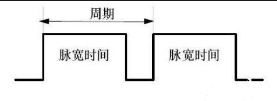

- Prescaler（预分频器）：把APB1的时钟频率进行一个比例处理，当我们使用高级外部时钟时，将频率拉满达到72MHZ，这个频率过快，对于计数器很快就会填满，所以一般进行一个缩小，公式如下；


- Counter Period（⾃动重装值ARR），其中ARR是AutoReload Register，他的意思是计数器计到某个值就归零（Reload），这决定PWM的周 期，那他决定PWM周期的公式如下：

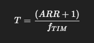

- Pulse（CCR寄存器值，占空⽐），它定义了⼀个⽐较值，决定PWM的占空⽐， 它的公式如下：

  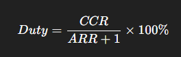

  **一般来说预分频，自动重装载值一般在前期确定，在之后代码段不进行改变，所以我们一般通过控制CCR来进行信号控制**

  ### 2.2 PWM波的具体使用：

  #### 2.2.1 LED流水灯

  • Prescaler=71→定时器时钟变成1MHz

  • ARR=999→周期=1000个计数，PWM周期=1ms(1kHz)

  ##### 代码展示：

  ```c
    /* Initialize all configured peripherals */
    MX_GPIO_Init();
    MX_TIM2_Init();
  
    /* USER CODE BEGIN 2 */
    /* USER CODE END 2 */
  
    /* Infinite loop */
    /* USER CODE BEGIN WHILE */
    while (1)
    {
  	for(int i=0;i<1000;i++)
      {
          __HAL_TIM_SET_COMPARE(m_tim,m_channel,compare); //__HAL_TIM_SET_COMPARE为一个宏变量，输入参数为时钟地址，时钟通道，CCR
          HAL_Delay(1); //延迟1ms
      }
       for(int i=1000;i>0;i--)
       {
  		__HAL_TIM_SET_COMPARE(m_tim,m_channel,compare); //__HAL_TIM_SET_COMPARE为一个宏变量，输入参数为时钟地址，时钟通道，CCR
          HAL_Delay(1); //延迟1ms
       } 				//实现LED从暗到最亮，再到暗的过程
      /* USER CODE END WHILE */
  
    /* USER CODE BEGIN 3 */
    }
  /* USER CODE END 3 */
  ```
  
  ##### 视频展示
  
  <video src="D:\Videos\CRTC\流水灯.mp4">
### 2.3 PWM在l298n中的作用

主要作用：通过输入IN1~IN4的pwm不同而实现马达的**反向旋转和变速**

L298N的接线如下：

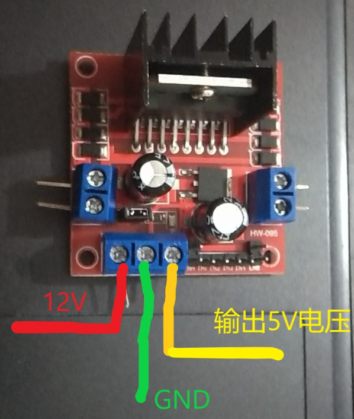

> 对于l298n，如果不摘使能帽，则可以输出一个5V的电压，如果摘掉，则需要接一个5v的输入电压
>
> **遇到的问题：**
>
> 当我向用L298N的5v输出给舵机供电，同时使用stm32提供一个pwm波时，发现舵机并没有进行理想转动，甚至没有发生转动
>
> **解决问题：**
>
> 在舵机的PWM输入由STM32提供，但stm32没有与L298N共地，造成参考电平不同，从而无法生成转动

---

**具体功能展示：**

##  3.舵机转动

**控制原理：**

对于舵机控制来说，PWM信号的周期一般是20ms，而脉冲宽度则决定了舵机的转动角度。不同的脉冲宽度对应着舵机不同的目标角度。例如，在常见的舵机中，脉冲宽度为1.5ms时，舵机通常处于中间位置（0°）；脉冲宽度为1.0ms时，舵机可能会转到最小角度（如 -90°）；脉冲宽度为2.0ms时，舵机可能会转到最大角度（如 +90°）。

**参数调整：**

  Precsaler:72-1

  ARR：2* 10^4^-1 *根据公式可以算出此时T = 20ms*

  其中pulse为不同时间时，舵机角度

  

**代码展示：**

  ```c
    /* Initialize all configured peripherals */
    MX_GPIO_Init();
    MX_TIM2_Init();
    /* USER CODE BEGIN 2 */
    HAL_GPIO_WritePin(GPIOC,GPIO_PIN_13,GPIO_PIN_RESET);
    HAL_TIM_PWM_Start(&htim2,TIM_CHANNEL_1);
    int count = 1500;
    /* USER CODE END 2 */
  
    /* Infinite loop */
    /* USER CODE BEGIN WHILE */
    while (1)
    {
  	  count=(count+500)%3000;
  	  if(count==0)
  		  count=500;
  	  __HAL_TIM_SET_COMPARE(&htim2,TIM_CHANNEL_1,count);
  	  HAL_Delay(1000);
      /* USER CODE END WHILE */
  
      /* USER CODE BEGIN 3 */
    }
    /* USER CODE END 3 */
  ```

  

**视频展示：**

<video src="D:\Videos\CRTC\舵机转动.mp4">
## 4. 马达转动

**控制原理：**

TT马达的转速与施加在其两端的电压成正比。当使用PWM信号控制TT马达时，虽然PWM信号是脉冲形式的，但马达由于自身的惯性，不会对快速变化的脉冲信号做出快速响应，而是对脉冲信号的平均电压做出响应。通过改变PWM信号的占空比，就可以改变施加在马达两端的平均电压。

**代码展示：**

```c
    /* Initialize all configured peripherals */
    MX_GPIO_Init();
    MX_TIM2_Init();
    /* USER CODE BEGIN 2 */
    HAL_GPIO_WritePin(GPIOC,GPIO_PIN_13,GPIO_PIN_RESET);
    HAL_TIM_PWM_Start(&htim2,TIM_CHANNEL_1);
    int count = 1500;
    /* USER CODE END 2 */
  
    /* Infinite loop */
    /* USER CODE BEGIN WHILE */
    while (1)
    {
  	  count=(count+500)%3000;
  	  if(count==0)
  		  count=500;
  	  __HAL_TIM_SET_COMPARE(&htim2,TIM_CHANNEL_1,count);
  	  HAL_Delay(1000);
      /* USER CODE END WHILE */
  
      /* USER CODE BEGIN 3 */
    }
    /* USER CODE END 3 */
```

使用之前控制舵机的代码，则会观察到马达有规律地按不同转速转动

## 5. PS2手柄的使用

### 5.1 SPI协议

>因为这次比赛使用的是用**GPIO模拟SPI**，接下来将详细介绍模拟过程：

全称Serial Peripheral Interface（串⾏外设接⼝），是⼀种由Motorola定义的同步通信协议。它 是典型的主从式通信，由⼀个主机（Master）控制⼀个或多个从机（Slave）

SPI 通常有 4 根信号线：

| 信号线   | 名称     | 方向（主设备角度） | 说明               |
| -------- | -------- | ------------------ | ------------------ |
| SCK      | 时钟线   | 输出               | 主机产生时钟脉冲   |
| MOSI     | 主出从入 | 输出               | 主机发送数据       |
| MISO     | 主入从出 | 输入               | 主机接收数据       |
| CS / NSS | 片选线   | 输出               | 低电平表示选中从机 |

------

## 

1. DAT<----MISO
MISO是Master Input Slave Output，即从机向主机发送数据，那么DAT就是data，即从机发来的数
据，也就是单⽚机接收⼿柄发来的数据的引脚。
2. CMD---->MOSI
CMD即command，也就是主机的命令，那么MOSI是Master Output Slave Input，即主机向从机发送
数据，在实际使⽤过程中，这个只是主机向⼿柄发送信号来实现振动等需求会使⽤到的引脚，⽽对于
校赛来说，这⼀部分可能在校赛中⽤不到，但是在SPI的通信协议中，从机同样需要主机的反馈才能知
道发送正在进⾏，所以这⼀部分我们仍然需要，只是发送的内容随意。
3. CS---->CS/NSS
Chip Select/Slave Select，也就是选择谁去接收信号，这⼀部分主要和我们的PS2⼿柄对频相关，主
要实现原理就是通过拉低对应从机引脚的电平来控制SPI总线上谁来接收消息。其中CS是通⽤叫法，NSS是STM32官⽅在SPI外设中的命名。
4. CLK---->SCK
Clock和Serial Clock，本质上意义相同，它们协调⼯作的逻辑依赖于时钟，这也是SPI总线控制的⼼
脏。

**数据发送接收过程如下：**

SPI数据发送接收
SPI主机和从机都有一个串行移位寄存器，主机通过向它的SPI串行寄存器写入一个字节来发起一次传输。

1. 首先拉低对应SS信号线，表示与该设备进行通信
2. 主机通过发送SCLK时钟信号，来告诉从机写数据或者读数据，这里要注意，SCLK时钟信号可能是低电平有效，也可能是高电平有效，因为SPI有四种模式，这个在下面会介绍
3. 主机(Master)将要发送的数据写到发送数据缓存区(Menory)，缓存区经过移位寄存器(0~7)，串行移位寄存器通过MOSI信号线将字节一位一位的移出去传送给从机，，同时MISO接口接收到的数据经过移位寄存器一位一位的移到接收缓存区。
4. 从机(Slave)也将自己的串行移位寄存器(0~7)中的内容通过MISO信号线返回给主机。同时通过MOSI信号线接收主机发送的数据，这样，两个移位寄存器中的内容就被交换。

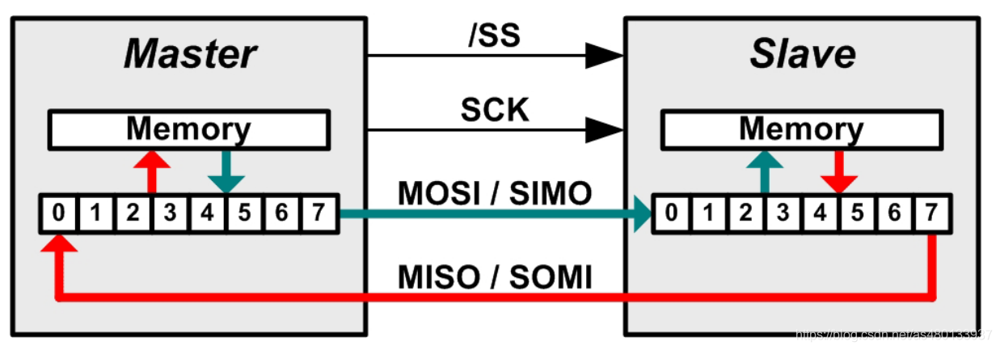

SPI通信有4种不同的操作模式，不同的从设备可能在出厂是就是配置为某种模式，这是不能改变的；但我们的通信双方必须是工作在同一模式下，所以我们可以对我们的主设备的SPI模式进行配置，通过CPOL（时钟极性）和CPHA（时钟相位）来
控制我们主设备的通信模式，具体如下：

时钟极性(CPOL)定义了时钟空闲状态电平：

- CPOL=0，表示当SCLK=0时处于空闲态，所以有效状态就是SCLK处于高电平时
- CPOL=1，表示当SCLK=1时处于空闲态，所以有效状态就是SCLK处于低电平时
  时钟相位(CPHA)定义数据的采集时间。

- CPHA=0，在时钟的第一个跳变沿（上升沿或下降沿）进行数据采样。，在第2个边沿发送数据
- CPHA=1，在时钟的第二个跳变沿（上升沿或下降沿）进行数据采样。，在第1个边沿发送数据

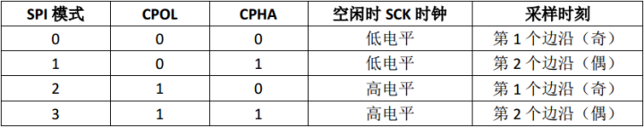

### 5.2 代码模拟SPI

#### 5.2.1 GPIO 模拟 SPI 思路

通过**软件控制 GPIO 电平变化**来产生时钟、发送与接收信号。

每发送一位：

1. 设置时钟线为低；
2. 主机在 MOSI 上放一位数据；
3. 拉高时钟线（同时从机在上升沿采样数据）；
4. 读取 MISO；
5. 重复 8 次，组成一个字节。

#### 5.2.2 示例代码

##### 定义引脚

我们使用：

- SCK → PA7
- MOSI → PA4
- MISO → PA5
- CS → PA6

```c
// PS2手柄的输入输出端口定义
#define DI_PORT     GPIOA
#define DI_PIN      GPIO_PIN_4

#define CMD_PORT    GPIOA
#define CMD_PIN     GPIO_PIN_5

#define CS_PORT     GPIOA
#define CS_PIN      GPIO_PIN_6

#define CLK_PORT    GPIOA
#define CLK_PIN     GPIO_PIN_7

// 宏定义简化IO操作
#define DI()        HAL_GPIO_ReadPin(DI_PORT, DI_PIN)
#define CMD_H()     HAL_GPIO_WritePin(CMD_PORT, CMD_PIN, GPIO_PIN_SET)
#define CMD_L()     HAL_GPIO_WritePin(CMD_PORT, CMD_PIN, GPIO_PIN_RESET)
#define CS_H()      HAL_GPIO_WritePin(CS_PORT, CS_PIN, GPIO_PIN_SET)
#define CS_L()      HAL_GPIO_WritePin(CS_PORT, CS_PIN, GPIO_PIN_RESET)
#define CLK_H()     HAL_GPIO_WritePin(CLK_PORT, CLK_PIN, GPIO_PIN_SET)
#define CLK_L()     HAL_GPIO_WritePin(CLK_PORT, CLK_PIN, GPIO_PIN_RESET)

```

##### 初始化 GPIO

在 `MX_GPIO_Init()` 里配置这几个引脚为输出推挽（MISO 为输入）：

```c
void AX_PS2_Init(void)
{
    GPIO_InitTypeDef GPIO_InitStruct = {0};

    // 使能GPIO时钟
    __HAL_RCC_GPIOA_CLK_ENABLE();

    // DATA引脚配置 - 输入上拉
    GPIO_InitStruct.Pin = DI_PIN;
    GPIO_InitStruct.Mode = GPIO_MODE_INPUT;
    GPIO_InitStruct.Pull = GPIO_PULLUP;
    HAL_GPIO_Init(DI_PORT, &GPIO_InitStruct);

    // COMMAND引脚配置 - 推挽输出
    GPIO_InitStruct.Pin = CMD_PIN;
    GPIO_InitStruct.Mode = GPIO_MODE_OUTPUT_PP;
    GPIO_InitStruct.Pull = GPIO_NOPULL;
    GPIO_InitStruct.Speed = GPIO_SPEED_FREQ_HIGH;
    HAL_GPIO_Init(CMD_PORT, &GPIO_InitStruct);

    // CS引脚配置 - 推挽输出
    GPIO_InitStruct.Pin = CS_PIN;
    HAL_GPIO_Init(CS_PORT, &GPIO_InitStruct);

    // CLK引脚配置 - 推挽输出
    GPIO_InitStruct.Pin = CLK_PIN;
    HAL_GPIO_Init(CLK_PORT, &GPIO_InitStruct);

    // 关闭PS2手柄使能
    CS_H();
}
```

##### 模拟 SPI 时序函数

```c
static uint8_t PS2_ReadWriteData(uint8_t cmd)
{
    uint8_t res = 0;
    uint8_t ref;

    // 写入命令，并读取一个1字节数据
    for(ref = 0x01; ref > 0x00; ref <<= 1)
    {
        // 输出一位数据
        if(ref & cmd)
            CMD_H();
        else
            CMD_L();

        CLK_L();
//        HAL_Delay(1); // 微秒级延时可能需要使用定时器实现，此处是使用了毫秒级延时
        delay_us(16);

        // 读取一位数据
        if(DI())
            res |= ref;

        CLK_H();
//        HAL_Delay(1); // 微秒级延时可能需要使用定时器实现，此处是使用了毫秒级延时
        delay_us(16);
    }

    return res;
}
```

---


##### 扫描手柄

```c
void AX_PS2_ScanKey(JOYSTICK_TypeDef *JoystickStruct)
{
    // 1. 使能手柄（CS拉低）
    CS_L();

    // 2. 发送9字节命令并接收9字节数据
    const uint8_t PS2_cmnd[9] = {0x01, 0x42, 0x00, ...};
    for(i = 0; i < 9; i++)
    {
        PS2_data[i] = PS2_ReadWriteData(PS2_cmnd[i]);
    }

    // 3. 关闭手柄（CS拉高）
    CS_H();

    // 4. 解析数据
    JoystickStruct->mode = PS2_data[1];      // 模式（0x41=数字, 0x73=模拟）
    JoystickStruct->btn1 = ~PS2_data[3];     // 按键组1（取反是因为按下为0）
    JoystickStruct->btn2 = ~PS2_data[4];     // 按键组2
    JoystickStruct->RJoy_LR = PS2_data[5];   // 右摇杆左右（0-255）
    JoystickStruct->RJoy_UD = PS2_data[6];   // 右摇杆上下
    JoystickStruct->LJoy_LR = PS2_data[7];   // 左摇杆左右
    JoystickStruct->LJoy_UD = PS2_data[8];   // 左摇杆上下
}

```

------

### 5.3 PS2控制舵机转动

##### 代码展示

```c
/**
  * @brief  通过PS2方向键控制舵机角度
  * @param  JoystickStruct: PS2手柄数据结构体指针
  * @param  htim: 定时器句柄（用于PWM输出）
  * @param  Channel: 定时器通道
  * @retval 当前舵机角度(0-180)
  */
uint8_t AX_PS2_ServoControl(JOYSTICK_TypeDef *JoystickStruct, TIM_HandleTypeDef *htim, uint32_t Channel)
{
    static uint32_t last_press_time = 0;  // 上次按键时间（防抖）
    uint32_t current_time = HAL_GetTick();
    
    // 定义方向键位掩码（基于PS2协议）
    const uint8_t DIR_UP    = 0x10;  // 上键 (bit 4)
    const uint8_t DIR_RIGHT = 0x20;  // 右键 (bit 5)
    const uint8_t DIR_DOWN  = 0x40;  // 下键 (bit 6)
    const uint8_t DIR_LEFT  = 0x80;  // 左键 (bit 7)
    
    // 按键防抖：100ms内不重复触发
    if(current_time - last_press_time < 100)
    {
        return servo_angle;
    }
    
    // 检测方向键并调整角度
    if(JoystickStruct->btn1 & DIR_UP)
    {
        // 上键：增加角度（大步长+10°）
        servo_angle += 10;
        if(servo_angle > 180)
            servo_angle = 180;
        last_press_time = current_time;
    }
    else if(JoystickStruct->btn1 & DIR_DOWN)
    {
        // 下键：减少角度（大步长-10°）
        if(servo_angle >= 10)
            servo_angle -= 10;
        else
            servo_angle = 0;
        last_press_time = current_time;
    }
    else if(JoystickStruct->btn1 & DIR_RIGHT)
    {
        // 右键：增加角度（小步长+1°）
        if(servo_angle < 180)
            servo_angle++;
        last_press_time = current_time;
    }
    else if(JoystickStruct->btn1 & DIR_LEFT)
    {
        // 左键：减少角度（小步长-1°）
        if(servo_angle > 0)
            servo_angle--;
        last_press_time = current_time;
    }
    
    // 将角度转换为PWM占空比并输出
    AX_Servo_SetAngle(htim, Channel, servo_angle);
    
    return servo_angle;
}

```

##### 视频展示

### 5.4 PS2控制马达转动

#### 代码展示

motor头文件展示：

```c
#ifndef MOTOR_CONTROL_H
#define MOTOR_CONTROL_H

#include "main.h"
#include "tim.h"
#include "ax_ps2.hpp"

/* 运动方向枚举 */
typedef enum {
    MOVE_FORWARD = 0,   // 向前
    MOVE_BACKWARD = 1,  // 向后
    MOVE_LEFT = 2,      // 向左
    MOVE_RIGHT = 3,     // 向右
    ROTATE_LEFT = 4,    // 左旋
    ROTATE_RIGHT = 5,   // 右旋
    MOVE_STOP = -1      // 停止
} MotorDirection_t;

/* 电机编号枚举 */
typedef enum {
    MOTOR_1 = 0,  // 电机1（htim4 CH1/CH2）
    MOTOR_2 = 1,  // 电机2（htim4 CH3/CH4）
    MOTOR_3 = 2,  // 电机3（htim2 CH1/CH2）
    MOTOR_4 = 3,  // 电机4（htim2 CH3/CH4）
    MOTOR_COUNT = 4
} MotorID_t;

/* 函数声明 */
void MotorControl_Init(void);
int GetMoveDirection(JOYSTICK_TypeDef *ps2_data);
void SetMotorSpeed(int direction_index, int compare_init_1, int compare_init_2);
void StopAllMotors(void);
void SetSingleMotor(MotorID_t motor_id, int compare1, int compare2);

/* 外部变量声明 */
extern int move_signal[6][4];
extern uint32_t tim_channel[4];
extern uint8_t dir[4];

#endif /* MOTOR_CONTROL_H */

```

motor_control源代码

```c
#include "motor_control.h"

/* 全局变量定义 */
uint8_t dir[4] = {16, 32, 64, 128};

/* 运动信号矩阵：[方向][电机] */
int move_signal[6][4] = {
    {-1, -1, 1, 1},    // 向前运动
    {1, 1, -1, -1},    // 向后运动
    {-1, 1, 1, -1},    // 向左运动
    {1, -1, -1, 1},    // 向右运动
    {-1, 1, -1, 1},    // 左旋
    {1, -1, 1, -1}     // 右旋
};

uint32_t tim_channel[4] = {
    TIM_CHANNEL_1,
    TIM_CHANNEL_2,
    TIM_CHANNEL_3,
    TIM_CHANNEL_4
};

/* 定时器映射表：每个电机对应的定时器 */
static TIM_HandleTypeDef* motor_timer_map[MOTOR_COUNT] = {
    &htim4,  // MOTOR_1
    &htim4,  // MOTOR_2
    &htim2,  // MOTOR_3
    &htim2   // MOTOR_4
};

/* 通道映射表：每个电机对应的通道索引 */
static const uint8_t motor_channel_offset[MOTOR_COUNT] = {
    0,  // MOTOR_1 uses CH1/CH2
    2,  // MOTOR_2 uses CH3/CH4
    0,  // MOTOR_3 uses CH1/CH2
    2   // MOTOR_4 uses CH3/CH4
};

/**
 * @brief  电机控制初始化
 * @param  None
 * @retval None
 */
void MotorControl_Init(void)
{
		__HAL_TIM_SET_COMPARE(&htim4, TIM_CHANNEL_1, 0);
	    __HAL_TIM_SET_COMPARE(&htim4, TIM_CHANNEL_2, 0);
	    __HAL_TIM_SET_COMPARE(&htim4, TIM_CHANNEL_3, 0);
	    __HAL_TIM_SET_COMPARE(&htim4, TIM_CHANNEL_4, 0);
	    __HAL_TIM_SET_COMPARE(&htim2, TIM_CHANNEL_1, 0);
	    __HAL_TIM_SET_COMPARE(&htim2, TIM_CHANNEL_2, 0);
	    __HAL_TIM_SET_COMPARE(&htim2, TIM_CHANNEL_3, 0);
	    __HAL_TIM_SET_COMPARE(&htim2, TIM_CHANNEL_4, 0);

    HAL_Delay(50);

    // ========== 第二步：立即停止所有电机 ==========
    StopAllMotors();

    HAL_Delay(50);

    // ========== 第三步：启动PWM ==========
    HAL_TIM_PWM_Start(&htim4, TIM_CHANNEL_1);
    HAL_TIM_PWM_Start(&htim4, TIM_CHANNEL_2);
    HAL_TIM_PWM_Start(&htim4, TIM_CHANNEL_3);
    HAL_TIM_PWM_Start(&htim4, TIM_CHANNEL_4);

    HAL_TIM_PWM_Start(&htim2, TIM_CHANNEL_1);
    HAL_TIM_PWM_Start(&htim2, TIM_CHANNEL_2);
    HAL_TIM_PWM_Start(&htim2, TIM_CHANNEL_3);
    HAL_TIM_PWM_Start(&htim2, TIM_CHANNEL_4);

    HAL_Delay(50);

    // ========== 第四步：再次确保停止 ==========
    StopAllMotors();
}


/**
 * @brief  获取移动方向索引
 * @param  ps2_data: PS2手柄数据指针
 * @retval 方向索引 (-1表示停止)
 */
int GetMoveDirection(JOYSTICK_TypeDef *ps2_data)
{
    // 检查模式，如果是模式2则停止
    if(ps2_data->mode == 65 || ps2_data==NULL)
    {
        return MOVE_STOP;
    }

    // 判断方向
    if(ps2_data->LJoy_UD == 0)
    {
        return MOVE_FORWARD;
    }
    else if(ps2_data->LJoy_UD == 255)
    {
        return MOVE_BACKWARD;
    }
    else if(ps2_data->LJoy_LR == 0)
    {
        return MOVE_LEFT;
    }
    else if(ps2_data->LJoy_LR == 255)
    {
        return MOVE_RIGHT;
    }
    else if(ps2_data->btn2 == dir[3])
    {
    	return ROTATE_LEFT;
    }
    else if(ps2_data->btn2 == dir[1])
    {
    	return ROTATE_RIGHT;
    }

    return MOVE_STOP;
}

/**
 * @brief  设置单个电机速度
 * @param  motor_id: 电机ID (0-3)
 * @param  compare1: PWM比较值1
 * @param  compare2: PWM比较值2
 * @retval None
 */
void SetSingleMotor(MotorID_t motor_id, int compare1, int compare2)
{
    if(motor_id >= MOTOR_COUNT)
    {
        return;  // 参数检查
    }

    TIM_HandleTypeDef *timer = motor_timer_map[motor_id];
    uint8_t ch_offset = motor_channel_offset[motor_id];

    __HAL_TIM_SET_COMPARE(timer, tim_channel[ch_offset], compare1);
    __HAL_TIM_SET_COMPARE(timer, tim_channel[ch_offset + 1], compare2);
}

/**
 * @brief  设置电机速度
 * @param  direction_index: 方向索引
 * @param  compare_init_1: PWM比较值1
 * @param  compare_init_2: PWM比较值2
 * @retval None
 */
void SetMotorSpeed(int direction_index, int compare_init_1, int compare_init_2)
{
    // 参数检查
    if(direction_index < 0 || direction_index >= 6)
    {
        return;
    }

    // 遍历所有电机
    for(MotorID_t motor_id = MOTOR_1; motor_id < MOTOR_COUNT; motor_id++)
    {
        int compare1 = compare_init_1;
        int compare2 = compare_init_2;

        // 根据方向信号调整PWM占空比（反向电机）
        if(move_signal[direction_index][motor_id] == -1)
        {
            int temp = compare1;
            compare1 = compare2;
            compare2 = temp;
        }

        // 设置电机PWM
        SetSingleMotor(motor_id, compare1, compare2);
    }
}

/**
 * @brief  停止所有电机
 * @param  None
 * @retval None
 */
void StopAllMotors(void)
{
    // 清零所有TIM4通道
    __HAL_TIM_SET_COMPARE(&htim4, TIM_CHANNEL_1, 0);
    __HAL_TIM_SET_COMPARE(&htim4, TIM_CHANNEL_2, 0);
    __HAL_TIM_SET_COMPARE(&htim4, TIM_CHANNEL_3, 0);
    __HAL_TIM_SET_COMPARE(&htim4, TIM_CHANNEL_4, 0);

    // 清零所有TIM2通道
    __HAL_TIM_SET_COMPARE(&htim2, TIM_CHANNEL_1, 0);
    __HAL_TIM_SET_COMPARE(&htim2, TIM_CHANNEL_2, 0);
    __HAL_TIM_SET_COMPARE(&htim2, TIM_CHANNEL_3, 0);
    __HAL_TIM_SET_COMPARE(&htim2, TIM_CHANNEL_4, 0);
}

```

通过检测index值来对于不同的方向状态，再将每个马达的转动独立，并封装成函数

####  视频展示

<video src="D:\Videos\CRTC\马达转动.mp4">

<video src="D:\Videos\CRTC\PS控制小车运动.mp4">

## 6.麦轮运动解算

本次比赛我们队采取的是如下图所示的麦轮情况：

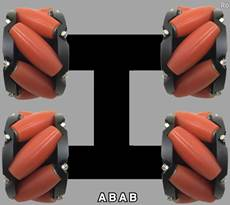

**麦轮特点：**

由斜着的多个滚轮组成，因此通过力学分析，每个滚轮所受的摩擦力可以简化为作用于滚轮中点，**方向与滚轮运动方向相反（即垂直于滚轮朝向，正负由麦轮滚动方向决定）**，速度方向则和朝向相同


#### 运动分析

1.前进：（AB轮可以相互抵消轴向速度，正转：沿辊子轴向上；反转：沿辊子轴向下）


2.倒退：（AB轮可以相互抵消轴向速度）

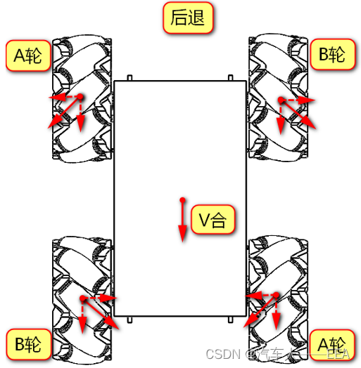

3.左移：（A轮反转，B轮正转）

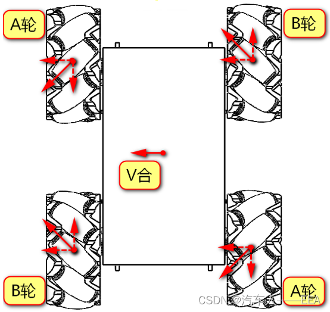

4.原地左转掉头：（左前：反转；右前正转；左后：反转；右后：正转。即同侧左：反转；同侧右：正转）

**原地掉头的原理：**

通过力学分析此时A轮产生了一对等大反向的力（力偶），B轮同理，因此合效果是一个总力矩

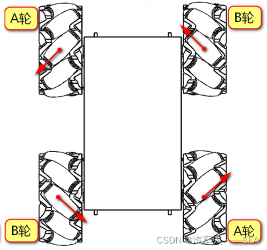

5.原地右转掉头：（左前：正转；右前反转；左后：正转；右后：反转。即同侧左：正转；同侧右：反转）

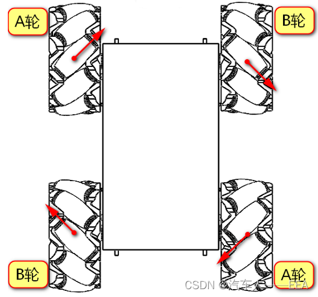

方向映射方程的代码如下

```c
/* 运动信号矩阵：[方向][电机] */
int move_signal[6][4] = {
    {-1, -1, 1, 1},    // 向前运动
    {1, 1, -1, -1},    // 向后运动
    {-1, 1, 1, -1},    // 向左运动
    {1, -1, -1, 1},    // 向右运动
    {-1, 1, -1, 1},    // 左旋
    {1, -1, 1, -1}     // 右旋
};

```

其中-1代表反向旋转，对于的两个IN引脚的pwm值相反

则处理如下:

```c
// 根据方向信号调整PWM占空比（反向电机）
        if(move_signal[direction_index][motor_id] == -1)
        {
            int temp = compare1;
            compare1 = compare2;
            compare2 = temp;
        }

        // 设置电机PWM
        SetSingleMotor(motor_id, compare1, compare2);
    }
```

####  视频展示

<video src="D:\Videos\CRTC\PS控制小车运动.mp4">

>  遇到的问题：
>
> 1. 连接好马达后各个轮子并没有按预期的转向运动
> 2. 在PS2未连接的时候马达就开始自行转动，连接上了也在为传达指令时转
>
> 解决办法：
>
> 1. 调整马达与L298N的out接线口即可解决问题
> 2. PS2未连接时，由于接线的不稳定可能导致电平变化，导致马达转动；PS2连接后，由于初始化时为设定初始值，可能导致初始化引脚时，引脚电平为随机值，在接上后则会随机转动
>
> 改进代码：
>
> ```c
> void MotorControl_Init(void)
> {
> 		__HAL_TIM_SET_COMPARE(&htim4, TIM_CHANNEL_1, 0);
> 	    __HAL_TIM_SET_COMPARE(&htim4, TIM_CHANNEL_2, 0);
> 	    __HAL_TIM_SET_COMPARE(&htim4, TIM_CHANNEL_3, 0);
> 	    __HAL_TIM_SET_COMPARE(&htim4, TIM_CHANNEL_4, 0);
> 	    __HAL_TIM_SET_COMPARE(&htim2, TIM_CHANNEL_1, 0);
> 	    __HAL_TIM_SET_COMPARE(&htim2, TIM_CHANNEL_2, 0);
> 	    __HAL_TIM_SET_COMPARE(&htim2, TIM_CHANNEL_3, 0);
> 	    __HAL_TIM_SET_COMPARE(&htim2, TIM_CHANNEL_4, 0);
> 
>     HAL_Delay(50);
> 
>     // ========== 第二步：立即停止所有电机 ==========
>     StopAllMotors();
> 
>     HAL_Delay(50);
> 
>     // ========== 第三步：启动PWM ==========
>     HAL_TIM_PWM_Start(&htim4, TIM_CHANNEL_1);
>     HAL_TIM_PWM_Start(&htim4, TIM_CHANNEL_2);
>     HAL_TIM_PWM_Start(&htim4, TIM_CHANNEL_3);
>     HAL_TIM_PWM_Start(&htim4, TIM_CHANNEL_4);
> 
>     HAL_TIM_PWM_Start(&htim2, TIM_CHANNEL_1);
>     HAL_TIM_PWM_Start(&htim2, TIM_CHANNEL_2);
>     HAL_TIM_PWM_Start(&htim2, TIM_CHANNEL_3);
>     HAL_TIM_PWM_Start(&htim2, TIM_CHANNEL_4);
> 
>     HAL_Delay(50);
> 
>     // ========== 第四步：再次确保停止 ==========
>     StopAllMotors();
> }
> 
> ```
>
> 代码优化：
>
> 1. 可能会遇到两个IN引脚同时输出高电平的情况，此时可能会导致L298N短路
>
> ```c
> void SetSingleMotor(MotorID motor, uint16_t compare1, uint16_t compare2)
> {
>     // 互斥保护
>     if (compare1 > 0 && compare2 > 0) {
>         // 强制只保留一个方向
>         compare2 = 0;
>     }
>     
>     // 死区保护
>     if (compare1 < 100) compare1 = 0;
>     if (compare2 < 100) compare2 = 0;
>     
>     switch(motor)
>     {
>         case MOTOR_1:
>             __HAL_TIM_SET_COMPARE(&htim4, TIM_CHANNEL_1, compare1);
>             __HAL_TIM_SET_COMPARE(&htim4, TIM_CHANNEL_2, compare2);
>             break;
>         // ...
>     }
> }
> 
> ```
>
> 2. 马达转速过慢
>
> ```c
> // 推荐配置:
> PSC = 0
> ARR = 3599
> 
> // 频率 = 72MHz / 1 / 3600 = 20kHz
> 
> // 修改CubeMX配置后重新生成代码
> 
> ```
>
> 